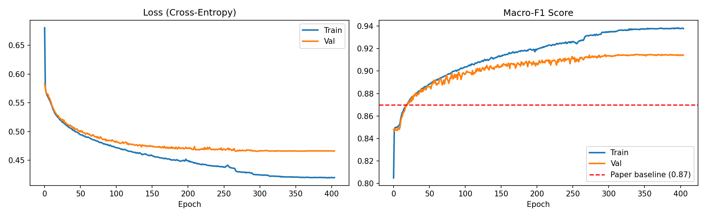
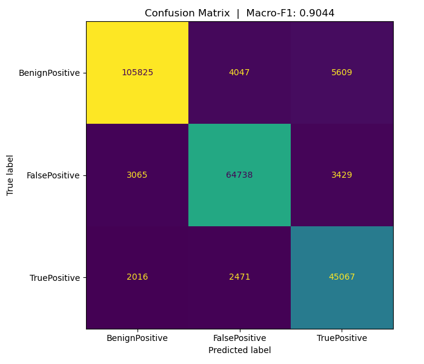
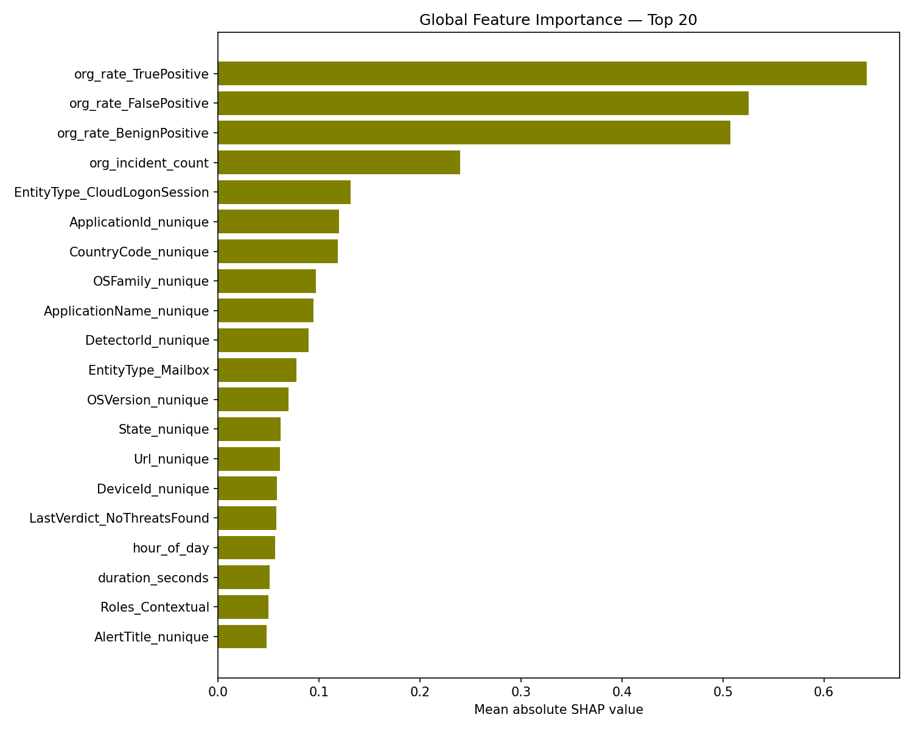
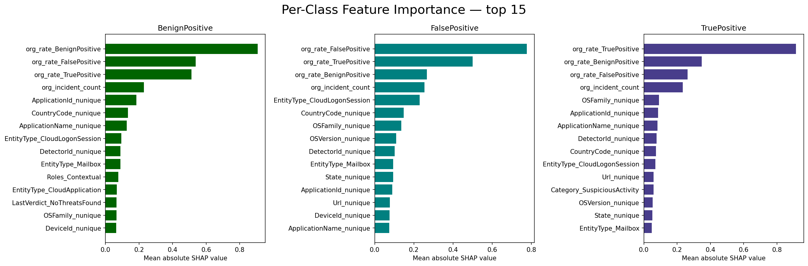
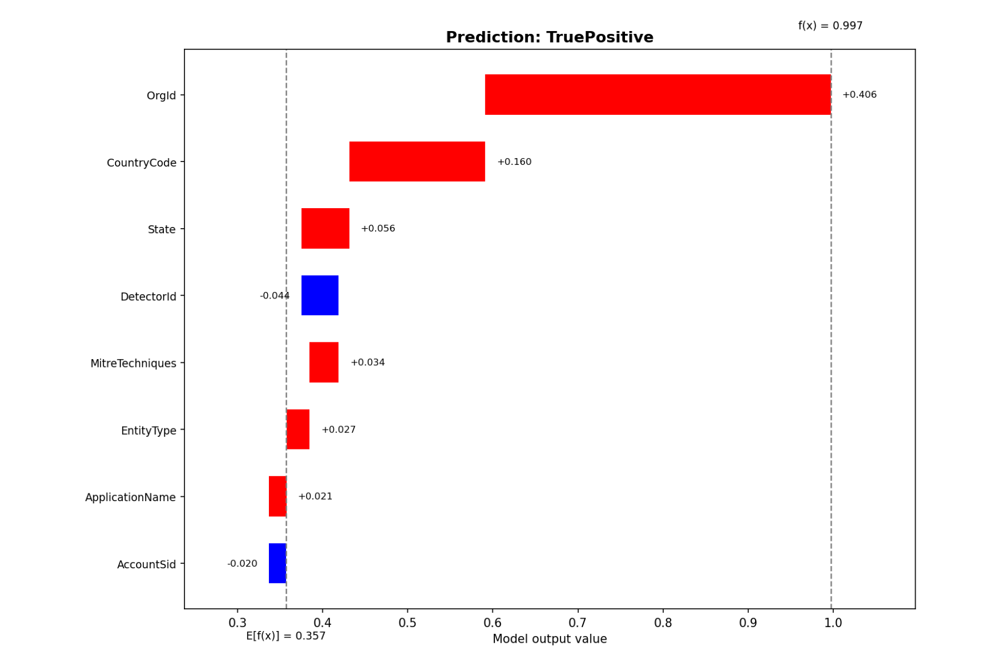

# GUIDE Incident Classifier

A production-ready machine learning pipeline for automated cybersecurity incident triage built on the [Microsoft GUIDE dataset](https://www.kaggle.com/datasets/Microsoft/microsoft-security-incident-prediction). The system classifies incidents as **BenignPositive**, **FalsePositive**, or **TruePositive** from raw evidence rows, and explains every prediction with SHAP waterfall plots and LLM-generated analyst narratives.

**Test Macro-F1: 0.9085** — beats the paper baseline of 0.87.

---

## Table of Contents

- [Project Overview](#project-overview)
- [Results](#results)
- [Project Structure](#project-structure)
- [Pipeline](#pipeline)
- [Setup](#setup)
- [Running the Pipeline](#running-the-pipeline)
- [API Reference](#api-reference)
- [Architecture](#architecture)
- [Key Design Decisions](#key-design-decisions)
- [Artifacts Reference](#artifacts-reference)

---

## Project Overview

Security Operations Centers (SOCs) receive thousands of alerts daily. Manually triaging each one is slow and error-prone. This project automates that triage step — given the raw evidence rows from the Microsoft GUIDE dataset, the model predicts whether an incident is a genuine threat (TruePositive), a false alarm (FalsePositive), or a benign event (BenignPositive).

Beyond prediction, the system explains **why** it made each decision with a waterfall plot using SHAP values, and a Groq LLM narrative written for a SOC analyst.

---

## Results

| Metric | Value |
|---|---|
| Test Macro-F1 | **0.9085** |
| Paper baseline (Random Forest + PCA) | 0.87 |
| BenignPositive F1 | 0.9377 |
| FalsePositive F1 | 0.9112 |
| TruePositive F1 | 0.8767 |

### Training Curves


### Confusion Matrix


### Global Feature Importance (SHAP)


### Per-Class Feature Importance (SHAP)


---

## Project Structure

```
guide-incident-classifier/
│
├── data/
│   ├── GUIDE_Train.csv              ← raw training data (~2.4 GB)
│   ├── GUIDE_Test.csv               ← raw test data (~1.1 GB)
│   └── processed/
│       ├── train_data.parquet       ← aggregated training features
│       ├── validation_data.parquet  ← aggregated validation features
│       └── test_data.parquet        ← aggregated test features
│
├── artifacts/
│   ├── best_model.pth               ← trained model weights
│   ├── scaler.pkl                   ← fitted StandardScaler
│   ├── model_config.json            ← input_dim, feature_cols,num_classes, classes, best_val_f1, test_f1
│   ├── cat_mappings.json            ← categorical value cardinality filter
│   ├── org_stats.parquet            ← per-org historical grade rates
│   ├── feature_groups.json          ← maps original columns → aggregated feature names
│   ├── shap_background.npy          ← background samples for SHAP explainer
│   ├── shap_values.npy              ← precomputed SHAP values (xai.ipynb)
│   ├── feature_importance.csv       ← ranked feature importance table
│   ├── training_curves.png
│   ├── confusion_matrix.png
│   ├── xai_global_importance.png
│   ├── xai_per_class_importance.png
│   ├── xai_beeswarm_BenignPositive.png
│   ├── xai_beeswarm_FalsePositive.png
│   └── xai_beeswarm_TruePositive.png
│
├── aggregation.py                   ← shared aggregation,de-aggregation logic (notebook + server)
├── data_aggregation.ipynb           ← data pipeline: raw CSV → parquet features
├── model_training.ipynb             ← model training, evaluation, artifact saving
├── xai.ipynb                        ← SHAP analysis: global, per-class, beeswarm plots
├── server.py                        ← FastAPI deployment server
└── test.ipynb                       ← server testing notebook
```

---

## Pipeline

The project runs in four sequential steps:

```
GUIDE_Train.csv          GUIDE_Test.csv
       │                        │
       ▼                        ▼
┌─────────────────────────────────────┐
│       data_aggregation.ipynb        │
│  raw evidence rows → aggregated     │
│  incident-level features            │
│  Saves: processed parquets,         │
│         cat_mappings.json,          │
│         org_stats.parquet,          │
│         feature_groups.json         │
└─────────────────────────────────────┘
               │
               ▼
┌─────────────────────────────────────┐
│       model_training.ipynb          │
│  Train ResidualMLP, evaluate,       │
│  save weights and artifacts         │
│  Saves: best_model.pth,             │
│         scaler.pkl,                 │
│         model_config.json,          │
│         training_curves.png,        │
│         confusion_matrix.png        │
└─────────────────────────────────────┘
               │
               ▼
┌─────────────────────────────────────┐
│           xai.ipynb                 │
│  SHAP analysis on validation data   │
│  Saves: shap_background.npy,        │
│         shap_values.npy,            │
│         feature_importance.csv,     │
│         xai_*.png plots             │
└─────────────────────────────────────┘
               │
               ▼
┌─────────────────────────────────────┐
│           server.py                 │
│  FastAPI server — loads all         │
│  artifacts at startup, serves       │
│  predictions and explanations       │
└─────────────────────────────────────┘
```

---

## Setup

### Requirements

```
Python 3.10+
CUDA-capable GPU (recommended — runs on CPU but SHAP will be slow)
```

### Install dependencies

```bash
pip install pandas numpy scikit-learn torch fastapi uvicorn pydantic joblib shap matplotlib groq
```

### Download the dataset

Download `GUIDE_Train.csv` and `GUIDE_Test.csv` from the [Microsoft GUIDE dataset page](https://www.kaggle.com/datasets/Microsoft/microsoft-security-incident-prediction) and place them in the `data/` folder.

### Set your Groq API key (for LLM explanations)

Get a free key at [console.groq.com](https://console.groq.com) — no credit card required.

```bash
# Windows CMD
set GROQ_API_KEY=gsk_your_key_here
```

---

## Running the Pipeline

Run the notebooks **in order** from the project root directory:

### Step 1 — Data aggregation
```
Open and run: data_aggregation.ipynb
```
Aggregates 9.5M evidence rows into 404k incident-level feature vectors.
Saves processed parquets and all training-time artifacts.

### Step 2 — Model training
```
Open and run: model_training.ipynb
```
Trains the ResidualMLP for up to 1000 epochs with early stopping.
Saves model weights, scaler, and config.

### Step 3 — XAI analysis
```
Open and run: xai.ipynb
```
Computes SHAP values on 1500 stratified validation samples.
Generates and saves all explanation plots.
Saves `shap_background.npy` which the server needs at startup.

### Step 4 — Start the server
```bash
# from the project root
uvicorn server:app --host 0.0.0.0 --port 8000 --reload
```

---

## API Reference

Once the server is running, interactive docs are available at `http://localhost:8000/docs`.

---

### `GET /health`

Returns server status and model metadata.

```json
{
  "status": "ok",
  "device": "cuda",
  "classes": ["BenignPositive", "FalsePositive", "TruePositive"],
  "num_features": 176,
  "best_val_f1": 0.918,
  "test_f1": 0.9085,
  "llm_available": true
}
```

---

### `GET /features/schema`

Returns valid categorical values for each categorical column. Useful for building input forms — values not in this list are treated as `"Other"`.

```json
{
  "categorical_fields": {
    "Category": ["Execution", "Persistence", "InitialAccess", "..."],
    "EntityType": ["User", "Ip", "Machine", "..."],
    "..."
  }
}
```

---

### `POST /predict`

Classify one or more incidents. Send a flat list of `EvidenceRow` objects — rows sharing the same `IncidentId` are grouped into one incident automatically.

**Request body:**
```json
[
  {
    "IncidentId": 238,
    "OrgId": 0,
    "Timestamp": "2024-06-06T08:10:50.000Z",
    "Category": "InitialAccess",
    "MitreTechniques": "T1078;T1078.004",
    "EntityType": "User",
    "EvidenceRole": "Impacted"
  },
  {
    "IncidentId": 238,
    "OrgId": 0,
    "Timestamp": "2024-06-06T00:48:32.000Z",
    "Category": "InitialAccess",
    "EntityType": "Ip",
    "EvidenceRole": "Related"
  }
]
```

All fields except `IncidentId` and `OrgId` are optional. Missing fields default to `null` and are treated as absent during aggregation.

**Response:**
```json
{
  "results": [
    {
      "incident_id": 238,
      "prediction": "TruePositive",
      "probabilities": {
        "BenignPositive": 0.0118,
        "FalsePositive": 0.0226,
        "TruePositive": 0.9656
      }
    }
  ]
}
```

**Example — Incident 238 from the test set:**

Incident 238 has 23 evidence rows across `InitialAccess` alerts with MITRE technique `T1078;T1078.004` (Valid Accounts).

```
Incident   : 238
Prediction : TruePositive
Probabilities : BenignPositive=1.18%  FalsePositive=2.26%  TruePositive=96.56%
```

---

### `POST /predict/explain`

Same as `/predict` but also returns a SHAP waterfall plot for each incident.

The waterfall shows the top 8 most impactful **original** features (de-aggregated from the 176 model features back to the 43 original columns). The baseline `E[f(x)]` is the model's average output across background incidents. `f(x)` is where the current incident lands after all feature contributions.

**Additional response field:**
```json
{
  "waterfall_png_b64": "<base64-encoded PNG string>"
}
```

**Example — Incident 238 waterfall plot:**



The dominant bar is `OrgId` (+0.4) — this organisation's 100% historical true-positive rate is by far the strongest signal pushing the prediction toward TruePositive. `CountryCode` and `state` add smaller positive contributions. The cumulation starts at `E[f(x)] = 0.357` (the model's average output across background incidents) and ends at `f(x) ≈ 0.9`, close to the actual predicted probability of 96.56%.

---

### `POST /predict/explain/text`

Same as `/predict/explain` but also returns an LLM-generated explanation written for a SOC analyst.

The LLM (Groq `llama-3.1-8b-instant`) receives the top-10 raw aggregated SHAP features with their actual values and a context prompt explaining what each aggregated feature means. It returns a 3-5 sentence narrative covering the prediction, the strongest drivers, and any caveats.

**Requires:** `GROQ_API_KEY` environment variable.

**Additional response field:**
```json
{
  "explanation": "The prediction indicates that this incident is likely a **TruePositive**, meaning it is a confirmed security threat with a high confidence level of 96.6%. The model predicts this with a 96.6% confidence, ruling out BenignPositive (1.2%) and FalsePositive (2.3%) possibilities.

The top 5 strongest reasons for this prediction are:

1. The organisation's historical rate of TruePositive incidents is 100%, indicating a high likelihood of this being a genuine threat.
2. The presence of 8 unique country codes suggests a potential global attack or command and control activity.
3. The absence of FalsePositive incidents in the organisation's history (0.0%) contributes to the prediction, as it reduces the likelihood of a false alarm.
4. The organisation's history of 1221 past incidents, while not directly contributing to the prediction, suggests a high level of security activity, which may be related to this incident.
5. The presence of 14 instances of MitreTechniques_T1078;T1078.004, a technique often associated with command and control activity, supports the prediction.

Caveat: The absence of unique DetectorIds (3) and ApplicationNames (1) may indicate a lack of specific threat information, which could impact the model's confidence in the prediction. Additionally, the presence of MitreTechniques_T1568;T1008 (0.0%) with a negative SHAP value may indicate that its absence contributed to the prediction, suggesting that this technique is not relevant to this incident."
}
```

---


## Architecture

### Feature Engineering (`aggregation.py`)

Raw evidence rows are aggregated to incident level using:

| Feature type | Count | Description |
|---|---|---|
| Entity uniqueness | 28 | `nunique` for each entity ID column |
| Temporal | 3 | `duration_seconds`, `hour_of_day`, `day_of_week` |
| Categorical pivots | 140+ | Count of evidence rows per category value |
| Org history | 4 | Historical grade rates + incident count per org |
| Evidence count | 1 | Total raw evidence rows in the incident |
| **Total** | **176** | |

The key insight is the **org history features** — computing `org_rate_TruePositive`, `org_rate_FalsePositive`, `org_rate_BenignPositive` and `org_incident_count` from training data only. The paper used proprietary internal Microsoft org statistics; these are reconstructed from the public dataset.

### Model (`model_training.ipynb`)

A 3-block Residual MLP:

```
Input (176) → Linear(256)
            → ResidualBlock(256→256)
            → ResidualBlock(256→128)
            → ResidualBlock(128→128)
            → BatchNorm → SiLU → Linear(3)
```

Each `ResidualBlock` follows the pattern: `BN → SiLU → Linear → BN → SiLU → Dropout(0.15) → Linear` with a skip connection.

Training configuration:
- Loss: CrossEntropyLoss with inverse-frequency class weights + label smoothing (0.1)
- Optimiser: AdamW (weight_decay=0.1)
- Scheduler: ReduceLROnPlateau (patience=15, factor=0.5)
- Early stopping: patience=40 epochs on val macro-F1
- Batch size: 16384

### XAI (`xai.ipynb`)

SHAP `GradientExplainer` is used because the model contains `BatchNorm` layers which can cause issues with `DeepExplainer`. The explainer uses 1500 stratified background samples (500 per class).

For deployment, the explainer is wrapped with `SoftmaxWrapper` so SHAP values are in probability space — this makes the waterfall interpretable: `E[f(x)] + sum(SHAP values) ≈ predicted probability`.

SHAP values are **de-aggregated** for the waterfall plot: the 176 aggregated model features are summed within their original column groups, reducing 176 bars to 43 original column names.

### Server (`server.py`)

FastAPI server that loads all artifacts once at startup and keeps them in a global `State` object. The aggregation pipeline runs server-side — callers send raw evidence rows identical to the CSV format.

Request flow:
```
Raw evidence rows (JSON)
  → aggregate_incidents()    ← uses pre-loaded cat_mappings + org_stats
  → StandardScaler.transform()
  → ResidualModel.forward()
  → softmax → prediction + probabilities

For /explain endpoints, additionally:
  → SoftmaxWrapper + GradientExplainer.shap_values()
  → deaggregate_shap()       ← sums SHAP within feature groups
  → make_waterfall_png()     ← cumulative waterfall → base64 PNG

For /text endpoint, additionally:
  → top-10 raw aggregated SHAP features
  → Groq LLM API → analyst narrative
```

---

## Key Design Decisions

**Incident-level train/val split** — the validation set is split at the incident level, not the evidence row level, to prevent data leakage. An incident's rows must all be in the same split.

**Aggregation in `aggregation.py`** — the aggregation logic is in a standalone module imported by both the notebook and the server. This eliminates code duplication and ensures the server uses exactly the same pipeline used during training.

**Org stats fitted on training data only** — `org_rate_*` features are computed from training incidents only and saved as `org_stats.parquet`. Validation and test incidents look up their org in this table. Unseen orgs get the training-set mean rate, not their actual rate, to prevent leakage.

**SHAP in probability space** — the explainer wraps the model with softmax so SHAP values and the baseline are both in probability space. This makes the waterfall numbers directly interpretable: the baseline is ~0.36 for a balanced background and the bars add up to the actual predicted probability.

**De-aggregation for the waterfall** — the 176 model features are summed within their original column groups (e.g. all `org_rate_*` columns summed into one `OrgId` bar). This produces a 43-bar waterfall using the original column names that a security analyst would recognise from the raw data.

---

## Artifacts Reference

All artifacts must exist before starting the server. They are produced by running the notebooks in order.

| Artifact | Produced by | Used by |
|---|---|---|
| `data/processed/*.parquet` | `data_aggregation.ipynb` | `model_training.ipynb`, `xai.ipynb` |
| `artifacts/cat_mappings.json` | `data_aggregation.ipynb` | `server.py`, `aggregation.py` |
| `artifacts/org_stats.parquet` | `data_aggregation.ipynb` | `server.py`, `aggregation.py` |
| `artifacts/feature_groups.json` | `data_aggregation.ipynb` | `server.py` |
| `artifacts/scaler.pkl` | `model_training.ipynb` | `xai.ipynb`, `server.py` |
| `artifacts/best_model.pth` | `model_training.ipynb` | `xai.ipynb`, `server.py` |
| `artifacts/model_config.json` | `model_training.ipynb` | `xai.ipynb`, `server.py` |
| `artifacts/shap_background.npy` | `xai.ipynb` | `server.py` |
| `artifacts/shap_values.npy` | `xai.ipynb` | `xai.ipynb` (plots only) |
| `artifacts/feature_importance.csv` | `xai.ipynb` | Reference |
| `artifacts/*.png` | `model_training.ipynb`, `xai.ipynb` | Reference |

---

## Author

**Moaaz Ahmed**
- GitHub: [@Moaaz Ahmed](https://github.com/MoaazSalter)